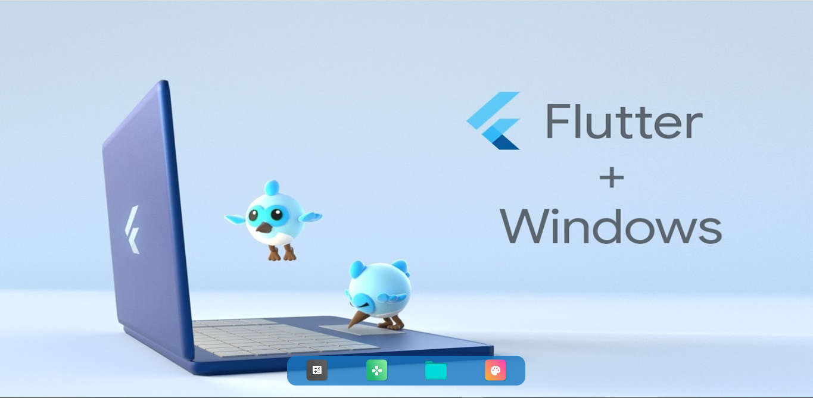

## Usage

* User controller for controlling docker
```dart
  DockController<FileType> dockController = DockController<FileType>(dockerItems, _onDockerItemClicked);
```

* Docker Icons List
* Place your docker icon assets into  "assets/icons/"  and use the asset name only;
* Use png image
```dart
   var dockerItems = [
  DockItem("Video Player", FileType.CALCULATOR,true,'ic_calculator'),
  DockItem("PDF Reader", FileType.GAME,true,'ic_game'),
  DockItem("HTML Reader", FileType.FOLDER,true,'folder'),
  DockItem("File Tree App", FileType.PAINTER,true,'ic_paint'),
];
```

* Use enum for define fileType
```dart
enum FileType {
  FOLDER,
  CALCULATOR,
  PAINTER,
  GAME,
};

```

* Use Dock Widget 
```dart
   Dock(controller: dockController);

```
